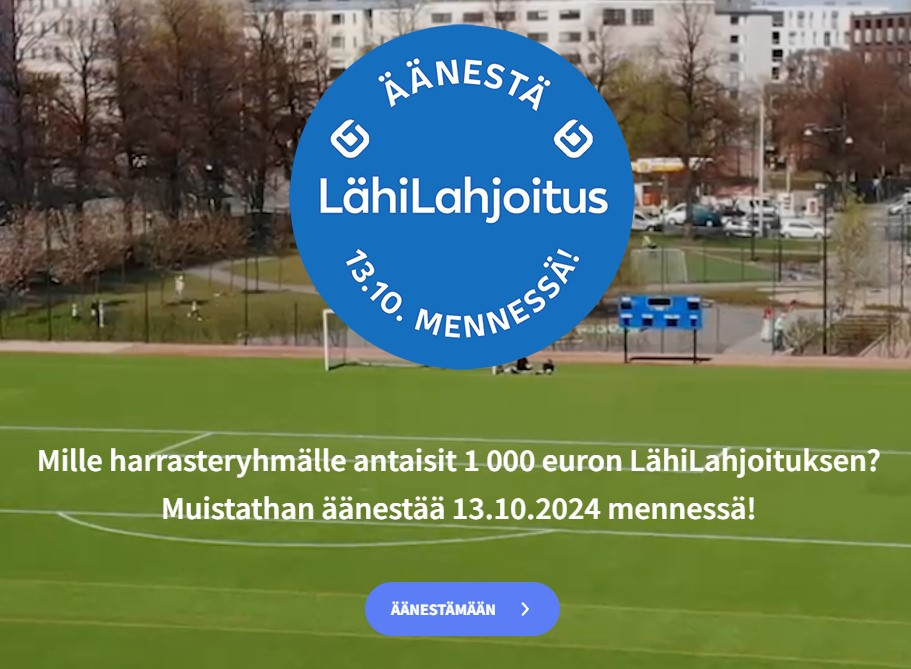
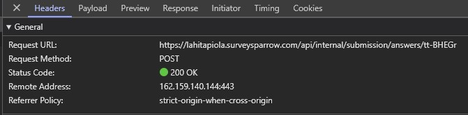
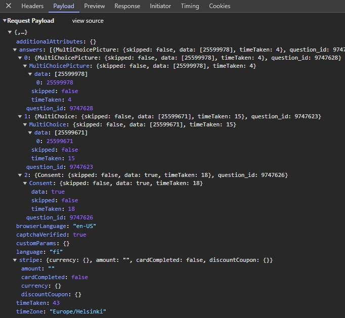
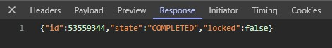

writeups:/root/random/lahilahjoitus
\
\
\
\[ LÄHILAHJOITUS - MANIPULATION OF A VOTING SYSTEM \]
\
\
\
This is a writeup about how I discovered a way to manipulate Lähitapiola Pääkaupunkiseutu Lähilahjoitus voting.
\
\
\
\
\[ THE BACKGROUND \]

Lähitapiola Pääkaupunkiseutu is a Lähitapiola bank branch that handles the business in the capital area of Finland.

Lähitapiola Pääkaupunkiseutu hosted a voting event, where the goal was to vote which children or youth sports organizations or clubs would be handed out 1000 euros. Lähitapiola Pääkaupunkiseutu would give out 1000 euros to 100 most voted clubs, distributed to Helsinki, Espoo and Vantaa areas.

The sports clubs had to sign up before hand to be part of the vote.

\[ THE EXPECTED \]

User visits Lähitapiola website, where a link is provided for the voting site:  

Clicking the image/link, user is directed to the actual voting site:  

With a few more clicks, the user selects the city (Helsinki, Espoo or Vantaa) and the sports club the user wants to give the vote to. And finally submits the vote:  

If the user tries to vote again using the browser, the user is shown a "thank you for voting" page.

\[ THE TECHNICAL \]

From Lähitapiola website, the link to the actual voting site leads to Surveysparrow.com website.  
This is not a Lähitapiola hosted website, but a 3rd party, which is hosting a platform for organizations or users to create surveys.

When the user submits the vote, a POST request is made to the SurveySparrow website:  
  
`tt-BHEGr` seems to be the unique path or identifier of the vote.

With the POST request, the data of the choices is sent to the SurveySparrow website:  

And the user is given a response to the POST request, that the vote was successful:  

With the POST event, the user is also given a cookie. This cookie indicates that the user has already voted.

When visiting the website again, if the cookie is found, the user can not give a new vote.

\[ THE UNEXPECTED \]

One could simply remove the cookie and vote again.

This is slow, and to make a real impact to the voting, a script could be made to manipulate the votes.

To implement the voting to the script, it's easy to copy the POST request from the browser history.  
Here is an example of Brave browser and copying the POST as Powershell command.  

The example request can be run in Powershell:  
  
The response giving new `id` and `COMPLETED` status.

This could be wrapped in a script, which posts the same POST request over and over again. Possible spreading the votes over the whole voting period.

\[ THE OUTCOME \]

There are several ways to manipulate the voting.

1. Giving some votes, impactful amount, to one club
2. Giving a lot of votes to one sports club
3. Giving a lot of votes to many clubs
4. Giving lots of random votes to make the voting a random result

In any of the cases, Lähitapiola Pääkaupunkiseutu faces several problems:

- Does Lähitapiola detect the manipulation of the votes?
  If not, the final vote is manipulated successfully.
- If they do, are they able to distinguish the manipulated votes from the non-manipulated?  
(my hunch is, they don't, as it requires a database access to the votes and a also enough information to distinguish the manipulated votes from the real ones)  
If yes, Lähitapiola must use resources to correct the situation.
- If they don't, what will Lähitapiola do with the voting?
- If there are some clubs that have clearly been manipulated, drop all those out from the voting, making all "legal" votes obsolete?
- Accept the result, no matter that it's been manipulated?
- Should Lähitapiola make an announcement that the results have been manipulated? 

\[ THE DISCOVERY \]

The Lähitapiola Pääkaupunkiseutu Lähilahjoitus voting was open from September 2024 to mid October 2024.

This was 2nd time the voting was held. Previously it was held in year 2023.  
During 2024, the idea has been adopted by other Lähitapiola branches. These votings have been held using different platforms.

I first discovered this in the year 2023, when the voting was held first time.  
During that time, I did not find the correct way to report the possibility of manipulation. I tried contacting Lähitapiola main office by some channel, but my choice was poor and never got a reply.

As the Lähilahjoitus voting was being held again in 2024, I decided to see if my report ever got through and if they had made any changes.  
When the voting was opened, I was not surprised to see that everything was the same as it was last year.

\[ THE REPORTING \]

This time I approached the reporting by using the Chat option on the Lähitapiola website.  
From there, the nice Chat person gave me an email address to the Lähitapiola Pääkaupunkiseutu customer service.

I emailed the customer service 16th of September 2024, requesting them to forward my mail to the person responsible of the Lähilahjoitus.  
In the email, I described how the manipulation could be done, with the technical details and my thoughts that the POST requests are going through and affecting the votes.  
To my surprise, Lähitapiola was very fast in giving me a reply. The person responsible for Lähilahjoitus (or so I think), replied me the very next day, 17th of September 2024.  
The person delivered me some background info about the success of Lähilahjoitus during 2023 and said that they will consider changing the platform and thanked me of the valuable insight.  
I replied the next day, thanking for the fast reply and giving some more thoughts about the matter. We had no further communication.

Timeline:
- 16-09-2024: reporting to Lähitapiola
- 17-09-2024: reply from Lähitapiola
- 18-09-2024: my reply to Lähitapiola, communication ends.

\[ THE FIX? \]

Lähitapiola Pääkaupunkiseutu wants the voting to be easy for it's users. This means no person identification is done through bank or common identification systems.  
With this in mind, it's hard to block all vote-manipulation attempts, without making the voting a harder process.

Currently, there is only a cookie check to stop users voting again.  
Several other ways could be implemented (but maybe not on SurveySparrow site), here are some examples:
- user must submit an email to vote and click on a link that is sent to the email address.
- using reCAPTCHA to confirm the voter is a person.

\[ THE THANKS \]

Thank you Lähitapiola Pääkaupunkiseutu for supporting kids and youth sports clubs with Lähilahjoitus.

See you on 2025, hopefully with a new platform.
\
\
\
\
\[[/root/random](../)\]
